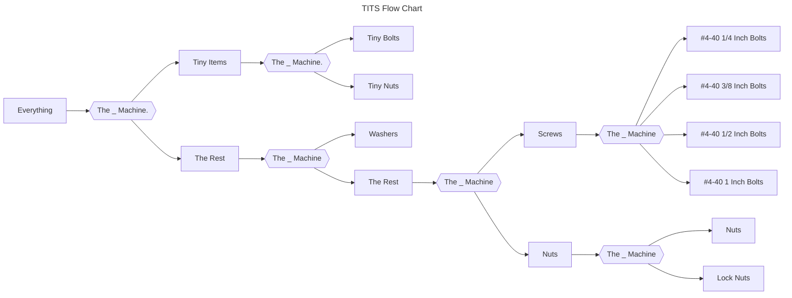
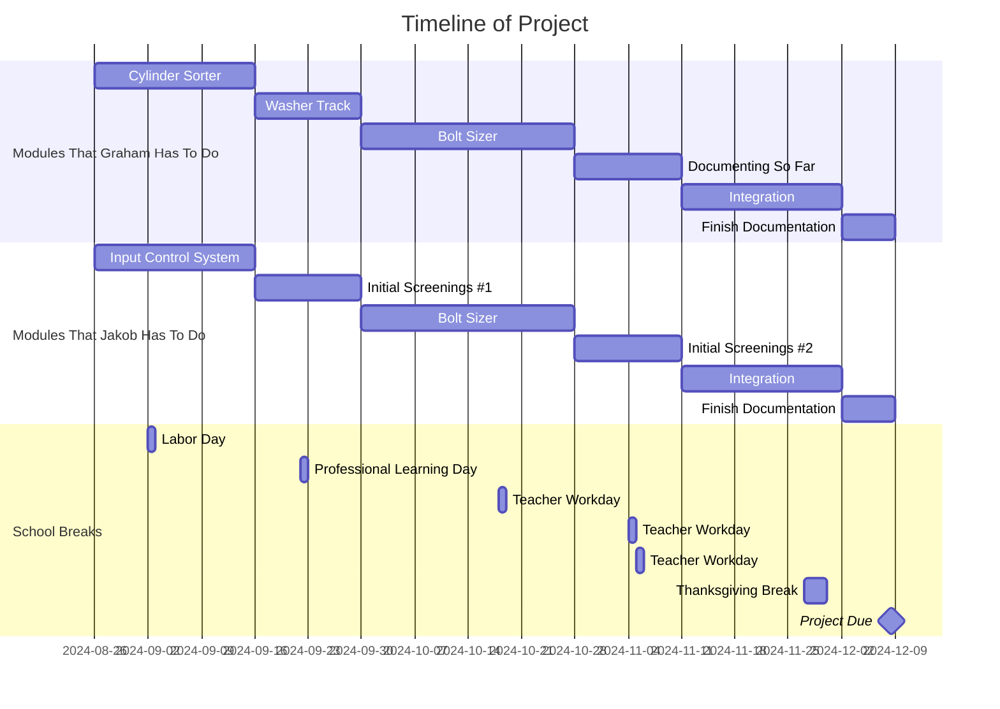
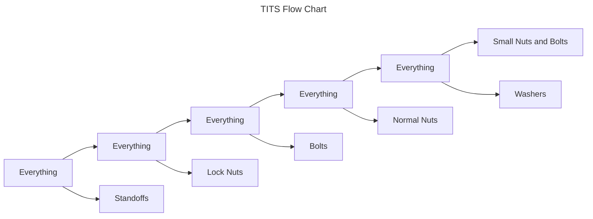

# Threaded Items Transfer System
# Planning
## Problem

| Problem | Solution |
| - | - |
| At the end of the school year, all of the nuts and bolts, etc. are not sorted and take hours to sort. | Our solution to this problem is a muti-stage machine that sorts everything into their respective sorted buckets. |

## Requirements 

| Essential | Non-Essential |
| - | - |
| The ability to sort between the “main groups” of materials in the lab. These materials are the tiny equipment: tiny nuts and bolts; the different nuts: lock nuts and normal; the different types of washers will be grouped because of the many micro differences; and sort the screws into their own catagory. | This will consist of sorting the tiny nuts from the tiny bolts, sorting the screws into M1, M2, M3, M4 etc., a higher accuracy in all of the components, and finally connecting all of the modules. This will be a module based project, so the user will have to manually move the unsorted pile from one system to another; therefore, the final non-essential requirement, and the point of why we put the word “auto in the title, will be to connect the modules and make it fully automatic. |

## Sucess Statement:
Success is measured through a 90% accuracy in sorting and zero total jams in the sorting of essential materials. Additionally, it will be essential that this project is documented to a level that could make anyone able to fix any problem that occurs.

# Conceptualize and Plan

### Materials we have to sort:
* #1-72, 3/8 Inch Bolts.
* #1-72 Nuts.
* #4-40 1/4 Inch Bolts.
* #4-40 3/8 Inch Bolts.
* #4-40 1/2 Inch Bolts.`
* #4-40 1 Inch Bolts
* #4-40 Nuts.
* #4-40 Lock Nuts.
* Washers

### Flow Chart

### Timeline

# SYSTEMS DOCUMENTATION
## The New Plan
Forget that whole plan you just saw. This is the actual plan, we realized very quickly that the hexagons could do the whole thing.

## Hexagonal Sorter

Each wall has a section taken out of it, a cut from the floor of the hexagon to a specific height. That height is measured to match the size of a particular object that this hexagon is designed to catch. In other words, think of it like a net. If you want to catch big fish, you don't use a closely knit/stitched net, you use a net with lots of space between the string to let the smaller fish fall through. Our stackable design is like fishing for hardware. We increasingly shrink the size of the net, from catfish catching size, to minnow catching size. In this case, minnows are our washers.

## Final Pictures

### HOW TO FIX ME?
There are only a few things that could go wrong with this design.
* The Acrylic Cracks
If this happens, just replace it. There are many redundant screws on the design, so even if one slot falls off or breaks it [should be ok.](#Docs)
* Its Connection Breaks
This is about the servo cap and servo connections with the hexagon. In this scenario, reprint the cap. We used the 4-way servo heads, and tiny bolts to secure the servo head to the servo cap.

# HOW TO FIX?
## Docs
[ONSHAPE:](https://cvilleschools.onshape.com/documents/672aa126c75f0bf0336b9dc3/w/92cd48f3c5af96a529a629e5/e/90918945a4e4bde3b3b8e3b7)
