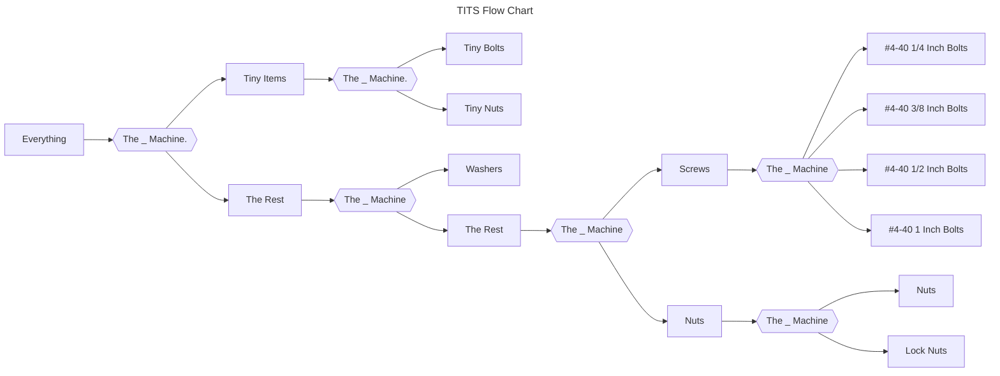
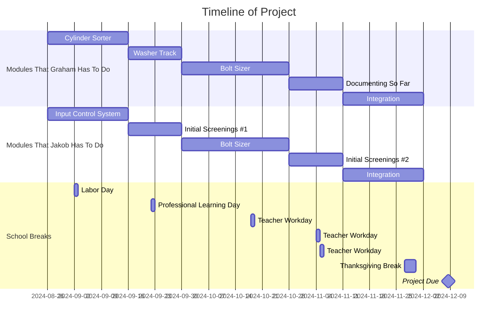

# Threaded Items Transfer System
# Planning
## Problem

| Problem | Solution |
| - | - |
| At the end of the school year, all of the nuts and bolts, etc. are not sorted and take hours to sort. | Our solution to this problem is a muti-stage machine that sorts everything into their respective sorted buckets. |

## Requirements 

| Essential | Non-Essential |
| - | - |
| The ability to sort between the “main groups” of materials in the lab. These materials are the tiny equipment: tiny nuts and bolts; the different nuts: lock nuts and normal; the different types of washers will be grouped because of the many micro differences; and sort the screws into their own catagory. | This will consist of sorting the tiny nuts from the tiny bolts, sorting the screws into M1, M2, M3, M4 etc., a higher accuracy in all of the components, and finally connecting all of the modules. This will be a module based project, so the user will have to manually move the unsorted pile from one system to another; therefore, the final non-essential requirement, and the point of why we put the word “auto in the title, will be to connect the modules and make it fully automatic. |

## Sucess Statement:
Success is measured through a 90% accuracy in sorting and zero total jams in the sorting of essential materials. Additionally, it will be essential that this project is documented to a level that could make anyone able to fix any problem that occurs.

# Conceptualize and Plan

### Materials we have to sort:
* #1-72, 3/8 Inch Bolts.
* #1-72 Nuts.
* #4-40 1/4 Inch Bolts.
* #4-40 3/8 Inch Bolts.
* #4-40 1/2 Inch Bolts.`
* #4-40 1 Inch Bolts
* #4-40 Nuts.
* #4-40 Lock Nuts.
* Washers

### Flow Chart

### Timeline

